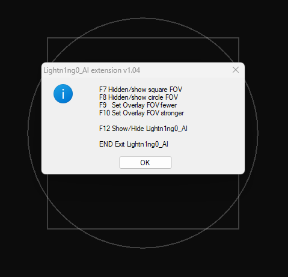

# Lightn1ng0_extension is a collection of custom extensions for Lightn1ng0_AI_Aimbot.

  

-Sets Lightn1ng0_AI_Aimbot menu to always foreground

-Rename Lightn1ng0_AI_Aimbot menu random

-Show/hide menu with one key

-Overlay frame removed

-ESP box can be changed

-Circle FOV added 

-square FOV added/edit

# Lightn1ng0_AI_Aimbot
Free AI Aimbot that works for every game in existence!  
Download: [https://github.com/Lightn1ng0/Lightn1ng0_AI_Aimbot/releases/](https://github.com/Lightn1ng0/Lightn1ng0_AI_Aimbot/releases)  
Setup video --> https://www.youtube.com/watch?v=MukvEr-iq44  
Support discord --> https://discord.com/invite/6wdzWT6BzH

WARNING: I DO NOT RECOMMEND YOU TO USE THIS TO GAIN AN UNFAIR ADVANTAGE IN ANY GAME  
THIS PROJECT WAS MADE FOR EDUCATIONAL PURPOSES ONLY  
I AM NOT RESPONSIBLE FOR ANY GAME ACCOUNT BANS THAT HAPPEN WHEN USING THIS PROGRAM

  

## Features
- Yolov5 and Yolov8
- Sensitivity
- Confidence
- Triggerbot
- Recoil control
- Aim shake
- Toggle or hold activation
- Keybind configurator
- Max fps
- Max move speed
- Preview
- Overlay
- Mask left/right or both
- Model size (detection area)
- Inference modes: pytorch (cpu), onnx (cpu, directml = any gpu), openvino (cpu, intel gpu) and tensorrt (nvidia gpu)
- No restart needed to apply settings
- Apex and fortnite model for yolov5 included (thanks to taipeiuser on discord for the fortnite model)
- Different mouse input methods --> see below

## Controller support
- Should work with xbox controllers and playstation controllers (if lucky, maybe a generic one would work)
- Select either dualshock for playstation or xbox for xbox
- You need to install the vigem bus driver -->  
https://github.com/nefarius/ViGEmBus/releases/download/v1.22.0/ViGEmBus_1.22.0_x64_x86_arm64.exe
- You will also need to install hidhide -->  
https://github.com/nefarius/HidHide/releases/download/v1.5.212.0/HidHide_1.5.212_x64.exe
- Setup video --> https://www.youtube.com/watch?v=SKdIwut7B2s

  

## Razer support
- Works only if you have a razer mouse connected to your computer when starting the code
- You need to install razer synapse 3 with the macro module https://www.razer.com/synapse-3
- Credits to https://github.com/0736b/rzctl-py/tree/main for the driver and the python file for it

  
  

## Arduino support
- You can use any arduino that supports the mouse library -->  
https://docs.google.com/spreadsheets/d/1VEzH8ou9MyX5zUId5USZp7kFP-7_YiLcAGa4o8niIM4/edit?usp=sharing
- You can use an usb host shield if you want
- Download and upload Mouse.ino to arduino
- Download and upload MouseShield.ino to arduino if using usb host shield
- Automatically tries to find the arduino com port when starting (you can still manually configure it)
- Credits to https://github.com/TrevorSatori/Leonardo/tree/main (for a huge part of the Mouse.ino)
- Thanks to duurtlang on discord for helping me out debugging Mouse.ino (Because I don't have an arduino myself)

  

## Issues
- No configuration saving atm :/
